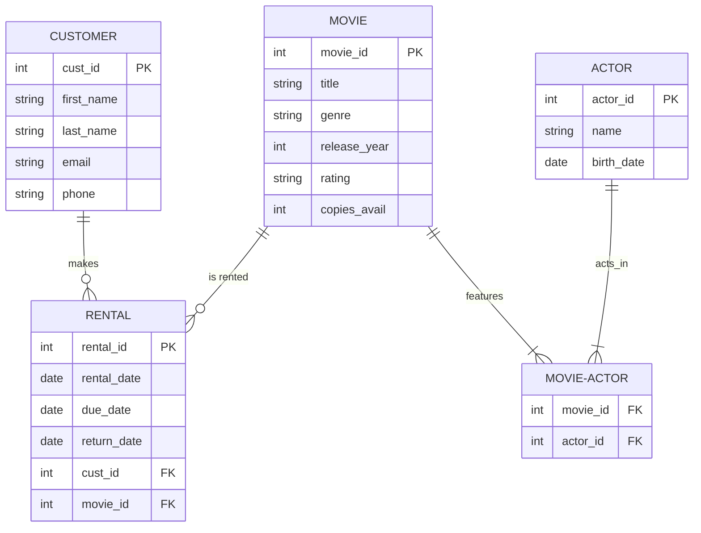

# ✅ Quiz — ER Modeling

Test your understanding before moving to the next module. There are 10 questions. Take your time, think carefully, and remember — this is for building your confidence.

---

## Question 1 (Multiple Choice)

What does "ER" stand for in ER Modeling?

- [ ] Electronic Record
- [ ] Entity-Relationship
- [ ] Error Reduction
- [ ] Extended Reference

---

## Question 2 (Multiple Choice)

Which of the following is an example of an entity in a university system?

- [ ] A student's GPA
- [ ] A course's credit hours
- [ ] An instructor
- [ ] An enrollment date

---

## Question 3 (Multiple Choice)

What is the purpose of a Primary Key?

- [ ] To connect two entities together
- [ ] To uniquely identify each instance of an entity
- [ ] To store the most important attribute
- [ ] To encrypt sensitive data

---

## Question 4 (Multiple Choice)

In a One-to-Many relationship between Department and Instructor, where does the Foreign Key go?

- [ ] In the Department entity
- [ ] In the Instructor entity
- [ ] In both entities
- [ ] In a separate junction entity

---

## Question 5 (Multiple Choice)

What type of relationship exists between Student and Course in a university system?

- [ ] One-to-One
- [ ] One-to-Many
- [ ] Many-to-Many
- [ ] No relationship

---

## Question 6 (Multiple Choice)

How do you implement a Many-to-Many relationship in a relational database?

- [ ] By adding a Foreign Key to both entities
- [ ] By creating a junction entity with Foreign Keys to both original entities
- [ ] By combining the two entities into one
- [ ] By using a special Many-to-Many data type

---

## Question 7 (Short Answer)

Explain the difference between an entity and an attribute. Give one example of each from the University Management System.

_______________________________________________
_______________________________________________
_______________________________________________

---

## Question 8 (Short Answer)

Why is ER modeling important to do BEFORE creating actual database tables? Use the "building a house" analogy in your answer.

_______________________________________________
_______________________________________________
_______________________________________________

---

## Question 9 (Short Answer)

Look at the partial ER description below and answer the questions:

Entity: Order

├── order_id (PK)

├── order_date

├── total_amount

├── customer_id (FK)

Entity: Customer

├── customer_id (PK)

├── first_name

├── last_name

├── email

a) What type of relationship exists between Customer and Order?

_______________________________________________

b) If customer_id 5 has placed 3 orders, how many records exist in the Order entity for this customer?

_______________________________________________

c) What would happen if you tried to create an order with customer_id = 99, but no customer with that ID exists?

_______________________________________________

---

## Question 10 (Short Answer)

Draw or describe a simple ER diagram for a **movie rental store** (like an old Blockbuster). Your diagram should include:

* At least 4 entities
* Primary Keys for each entity
* Relationships between entities
* At least one Many-to-Many relationship with a junction entity

* 
---

## ✅ Answer Key

Click to reveal answers and explanations

### Question 1
**Correct answer:** Entity-Relationship

**Why:** ER stands for Entity-Relationship. It's a modeling technique that identifies entities (things we track), their attributes (details), and how they relate to each other.

---

### Question 2
**Correct answer:** An instructor

**Why:** An instructor is an entity — a "thing" we want to store information about. GPA, credit hours, and enrollment dates are attributes (details about entities), not entities themselves.

---

### Question 3
**Correct answer:** To uniquely identify each instance of an entity

**Why:** A Primary Key ensures every record can be uniquely identified. It's not for connecting entities (that's Foreign Keys), storing importance, or encryption.

---

### Question 4
**Correct answer:** In the Instructor entity

**Why:** In a One-to-Many relationship, the Foreign Key always goes on the "many" side. Many instructors can belong to one department, so `department_id` goes in the Instructor entity.

---

### Question 5
**Correct answer:** Many-to-Many

**Why:** One student can enroll in many courses, and one course can have many students. This is a classic Many-to-Many relationship, implemented through the Enrollment junction entity.

---

### Question 6
**Correct answer:** By creating a junction entity with Foreign Keys to both original entities

**Why:** You can't directly implement Many-to-Many with Foreign Keys in the original tables (that would only give One-to-Many). A junction entity sits between them and holds Foreign Keys to both sides.

---

### Question 7
**Sample good answer:**

An entity is a thing we want to store information about — like a Student, Course, or Instructor. An attribute is a detail or property of that entity — like a student's email, a course's title, or an instructor's hire date.

**Example from University System:**
* Entity: Student
* Attribute: email (a detail about the student)

*(Any clear distinction with valid examples receives full credit.)*

---

### Question 8
**Sample good answer:**

ER modeling is like creating a blueprint before building a house. Without a blueprint, you might build walls in the wrong place, forget to add doors, or realize too late that the plumbing doesn't reach the bathroom. Similarly, without an ER model, you might create tables that don't connect properly, store data in the wrong places, or need to rebuild everything later. The blueprint saves time, money, and frustration.

*(Any answer that uses the blueprint analogy and explains the value of planning receives full credit.)*

---

### Question 9

**a)** One-to-Many. One customer can place many orders, but each order belongs to exactly one customer.

**b)** 3 records in the Order entity, all with `customer_id = 5`.

**c)** The database would reject the insert with a foreign key constraint violation. You cannot create an order for a customer who doesn't exist. This is referential integrity protecting your data.

---

### Question 10

**Sample good answer:**

*(Any reasonable schema with 4+ entities, correct Primary Keys, valid relationships, and at least one Many-to-Many with a junction entity receives full credit.)*

> 💬 **Remember:** ER modeling is a skill that improves with practice. Every database you design — whether for a class project, a personal app, or a job — will start with an ER diagram. The ability to translate real-world requirements into a clean visual blueprint is one of the most valuable skills you can have as a developer.

> 🚀 **Ready for the next module?** Soon we'll open PostgreSQL and turn these diagrams into real tables. Every rectangle will become a `CREATE TABLE` statement. Every line will become a relationship. Your blueprints are about to come to life!

Relationships:

Customer ──1:N──► Rental

Movie ────1:N──► Rental

Movie >──M:N──< Actor (via MovieActor junction)

Junction: MovieActor

├── movie_actor_id (PK)

├── movie_id (FK)

└── actor_id (FK)
