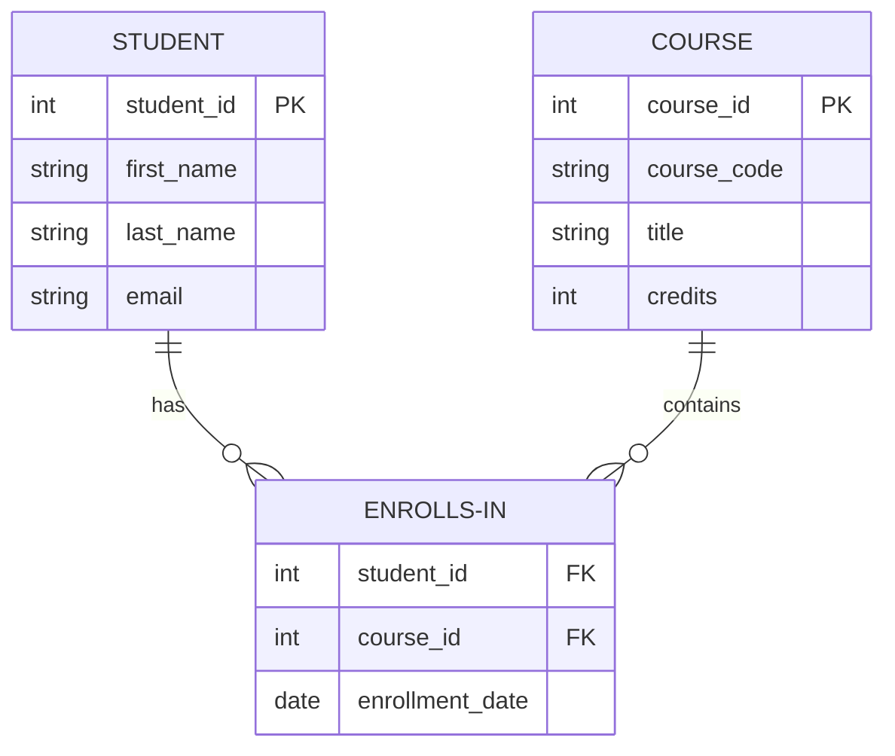
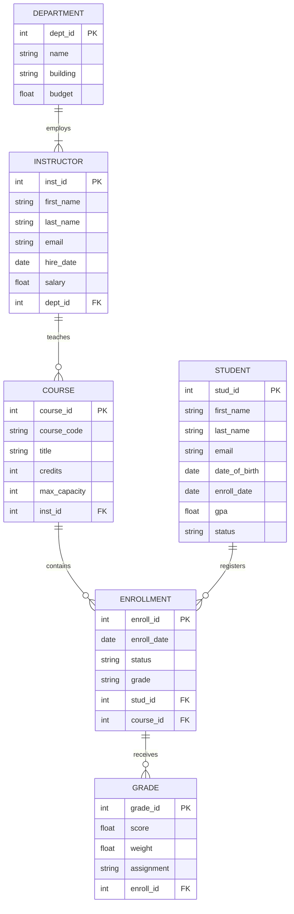
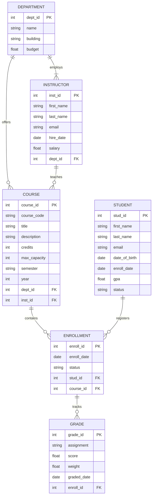

# 🧩 ER Modeling (Entity Relationship Modeling)

Welcome to Module 03! You've already learned what databases are and how they store information in tables, rows, and columns. You understand Primary Keys, Foreign Keys, and the three types of relationships. That's a solid foundation.

Now we're going to learn the **blueprint language of databases** — ER Modeling.

Think of it this way: before a construction crew builds a house, an architect draws detailed plans. Those plans show where the walls go, where the doors are, how the rooms connect, and where the plumbing runs. Without those plans, the builders would be guessing — and the house would probably have problems.

ER Modeling is the architect's blueprint for databases. It's how we **plan** our database before we write a single line of SQL. It's how we make sure our database makes sense, connects properly, and won't fall apart when real data starts flowing in.

By the end of this module, you'll be able to look at any real-world situation and sketch out a database design on paper. That's a powerful skill — and it's exactly what professional database designers do every day.

---

## 🎯 Learning Objectives

After completing this module, you will be able to:

* Explain what **ER Modeling** is and why it matters
* Identify **entities** in any real-world system
* List **attributes** that describe each entity
* Define **Primary Keys** and **Foreign Keys** in the context of ER diagrams
* Recognize and create **One-to-One**, **One-to-Many**, and **Many-to-Many** relationships
* Read and draw a basic **ER Diagram** using standard notation
* Design a simple ER model for the **University Management System**
* Spot common beginner mistakes in ER design and know how to avoid them
* Feel confident moving from "idea" to "database blueprint"

---

## 🧠 Why This Matters

Imagine you decide to build a house. You don't hire an architect. You don't draw any plans. You just start buying bricks and stacking them.

A few weeks in, you realize:
* The kitchen is too far from the dining room
* There's no space for the bathroom pipes
* The front door opens into a closet
* The second floor has no stairs connecting to it

Fixing these problems now means tearing down walls, re-pouring concrete, and starting over. It would have been so much easier — and cheaper — to draw a blueprint first.

**Database design works exactly the same way.**

If you start creating tables in PostgreSQL without a plan, you'll end up with:
* Tables that don't connect properly
* Data stored in the wrong places
* Information duplicated everywhere
* Queries that are slow and confusing
* A system that's hard to fix later

&gt; 🏗️ **ER Modeling is your blueprint.** It lets you plan, visualize, and fix problems *before* you build anything. It's the difference between a database that works beautifully and a database that becomes a nightmare.

### A Real-World Cautionary Tale

A small startup once built an online store without designing their database first. They created a `products` table, an `orders` table, and a `customers` table. Seemed fine.

Six months later, they needed to handle:
* Orders with multiple products
* Products with multiple categories
* Customers with multiple shipping addresses
* Discount codes that apply to specific products

Their original design couldn't handle any of this. They had to rebuild their entire database from scratch — while the business was running. It took three months, cost thousands of dollars, and caused weeks of downtime.

**All of that could have been avoided with a good ER model drawn on day one.**

&gt; 💡 **The lesson:** Spend time on design *before* you build. ER modeling is how you do that.

---

## 📖 What is ER Modeling?

**ER** stands for **Entity-Relationship**.

**ER Modeling** is a technique for designing databases by identifying:
1. **Entities** — the "things" we want to store information about
2. **Attributes** — the details we want to store about each thing
3. **Relationships** — how those things connect to each other

When you put these three pieces together, you create an **ER Diagram** — a visual map of your entire database.

### Why Do We Use ER Modeling?

Because **thinking visually is easier than thinking in code**.

When you draw boxes for entities, lines for relationships, and labels for attributes, you can see the whole system at a glance. You can spot problems before they become problems. You can discuss your design with teammates who don't know SQL yet.

ER modeling is the **bridge** between "I have an idea" and "I have a database."

### The Analogy: The Recipe Before Cooking

&gt; Imagine you're cooking a complex meal for twenty people.
&gt;
&gt; You could just start buying ingredients and cooking. But you'd probably forget the garlic, run out of pots, and realize the dessert needs to chill for four hours *after* dinner has started.
&gt;
&gt; Instead, you write a recipe first. You list ingredients, plan the steps, and figure out the timing.
&gt;
&gt; **ER modeling is writing the recipe before you cook.** It's planning before you build.

---

## 🧱 What is an Entity?

An **entity** is simply **something we want to store information about**.

That's it. Don't overthink it.

If you can point to it, name it, and describe it, it's probably an entity.

### Entities in Our University Management System

| Entity | What It Represents | Real-World Example |
|--------|-------------------|-------------------|
| **Student** | A person enrolled at the university | Alice Johnson, student ID 1001 |
| **Course** | A class offered by the university | Introduction to Programming, CS101 |
| **Instructor** | A professor who teaches courses | Dr. Sarah Smith |
| **Department** | An academic department | Computer Science, Mathematics |
| **Enrollment** | The connection between a student and a course | Alice is enrolled in CS101 |
| **Grade** | A score a student received | Alice got 85% on Assignment 1 |

&gt; 💡 **Key Insight:** An entity is a noun. It's a person, place, thing, or event. If you can say "the university has many ______," the blank is probably an entity.

### How to Find Entities

When you're designing a database for any system, ask yourself:

1. **What are the main "things" in this system?**
2. **What do we need to track information about?**
3. **What would users search for or report on?**

For a university:
* We need to track **students** → entity
* We need to track **courses** → entity
* We need to track who teaches what → **instructors** → entity
* We need to organize by **departments** → entity
* We need to know who's in which class → **enrollments** → entity
* We need to record scores → **grades** → entity

### Entities vs. Attributes — Don't Get Confused!

A common beginner mistake is mixing up entities and attributes.

| Entity | Attribute |
|--------|-----------|
| A thing we track | A detail about that thing |
| Student | first_name, last_name, email |
| Course | title, credits, course_code |
| Department | name, building, budget |

&gt; **Alice's email is not an entity.** Alice is the entity. Her email is just one piece of information about her.

---

## 🏷️ What are Attributes?

**Attributes** are the **details** we store about each entity.

If an entity is a person, attributes are the facts we know about that person.

### Attributes of a Student

Student

├── student_id      (a unique number for each student)

├── first_name      (their first name)

├── last_name       (their last name)

├── email           (their email address)

├── date_of_birth   (when they were born)

├── enrollment_date (when they started at the university)

├── gpa             (their grade point average)

└── status          (active, graduated, suspended)

### Attributes of a Course

Course

├── course_id       (a unique number for each course)

├── course_code     (like "CS101" or "MATH201")

├── title           (the full name of the course)

├── description     (what the course covers)

├── credits         (how many credit hours it's worth)

├── max_capacity    (how many students can enroll)

├── semester        (Fall, Spring, Summer)

└── year            (which academic year)

### Types of Attributes

Not all attributes are created equal. Here are the main types:

| Type | Description | Example |
|------|-------------|---------|
| **Simple** | Cannot be broken down further | `first_name`, `gpa` |
| **Composite** | Can be broken into parts | `full_name` → `first_name` + `last_name` |
| **Multi-valued** | Can have multiple values | A student might have multiple phone numbers |
| **Derived** | Calculated from other attributes | `age` calculated from `date_of_birth` |

> 💡 **For beginners:** Don't worry too much about attribute types. Just make sure every entity has the right attributes to describe it fully.

---

## 🔑 What are Keys?

Keys are special attributes that help us identify and connect entities. Think of them as the "addresses" of your data.

### Primary Key

A **Primary Key** is an attribute (or set of attributes) that **uniquely identifies** each instance of an entity.

**Rules:**
* Every entity MUST have a Primary Key
* No two records can have the same Primary Key value
* The Primary Key cannot be empty (NULL)

**In our University System:**

| Entity | Primary Key | Why This Works |
|--------|-------------|----------------|
| Student | `student_id` | Every student gets a unique number |
| Course | `course_id` | Every course gets a unique number |
| Instructor | `instructor_id` | Every instructor gets a unique number |
| Department | `department_id` | Every department gets a unique number |
| Enrollment | `enrollment_id` | Every enrollment record gets a unique number |
| Grade | `grade_id` | Every grade record gets a unique number |

> 🎯 **Remember:** A Primary Key is not the data itself — it's an identifier for the data. `student_id = 1001` doesn't tell you Alice's GPA. It just says "this is Alice's record."

### Foreign Key

A **Foreign Key** is an attribute in one entity that **references the Primary Key** of another entity.

Foreign Keys create **relationships** between entities.

**Example:**

Student                          Enrollment

├─ student_id (PK) ◄────────────├─ enrollment_id (PK)

├─ first_name                   ├─ student_id (FK)

├─ last_name                    ├─ course_id (FK)

└─ email                        └─ enrollment_date

The `student_id` in the `Enrollment` entity is a Foreign Key. It points to `student_id` in the `Student` entity.

This tells us: "This enrollment belongs to this specific student."

> 🔗 **Foreign Keys are how entities shake hands and say 'we're connected.'**

---

## 🔗 Understanding Relationships

Relationships describe **how entities interact** with each other. This is where the magic of relational databases happens.

There are exactly **three types** of relationships. Learn these, and you can design almost any database.

---

### One-to-One (1:1)

**Definition:** One instance of Entity A is related to exactly one instance of Entity B.

**University Example:** A student and their student ID card.

* One student has exactly one student ID card
* One student ID card belongs to exactly one student
Student ||───|| Student_ID_Card
1           1

> **In practice, 1:1 relationships are rare.** If two things are truly one-to-one, you usually just combine them into one entity. We separate them only when there's a good reason (like security, optional data, or performance).

**When to use 1:1:** When one entity has optional or sensitive information that you want to keep separate.

---

### One-to-Many (1:N)

**Definition:** One instance of Entity A can be related to many instances of Entity B. But each instance of Entity B is related to only one instance of Entity A.

**This is the most common relationship in databases.**

**University Examples:**

* **One Department → Many Instructors**
  * The Computer Science department has Dr. Smith, Dr. Jones, and Dr. Patel
  * But Dr. Smith works in only ONE department
Department ||───<| Instructor
1              N

* **One Instructor → Many Courses**
  * Dr. Smith teaches Introduction to Programming AND Database Systems
  * But each course has only ONE primary instructor (in our simple model)
Instructor ||───<| Course
1              N

* **One Student → Many Enrollments**
  * Alice is enrolled in 4 different courses
  * Each enrollment belongs to exactly ONE student
Student ||───<| Enrollment
1              N

> 💡 **How to spot a 1:N relationship:** Ask "Can one [A] have many [B]?" If yes, and "Can one [B] belong to many [A]?" is no, then it's One-to-Many.

---

### Many-to-Many (M:N)

**Definition:** One instance of Entity A can be related to many instances of Entity B. AND one instance of Entity B can be related to many instances of Entity A.

**University Example:** Students and Courses.

* One student can enroll in MANY courses
* One course can have MANY students enrolled
Student >|───<| Course
N           N

**The Problem:** You can't implement Many-to-Many directly in a relational database. You need a **junction entity** (also called an associative entity or linking table).

**The Solution:** Create an `Enrollment` entity that connects Students and Courses.
Student ||───<| Enrollment |>───|| Course
1              N              1

Now:
* One Student → Many Enrollments
* One Course → Many Enrollments
* Enrollment connects them both

> 🎯 **Key Insight:** Many-to-Many relationships are incredibly common. Whenever you think "X can have many Y, and Y can have many X," you need a junction entity.

---

## 🖼️ Understanding ER Diagrams

An **ER Diagram** is a visual representation of your database design. It shows entities, attributes, and relationships at a glance.

### Basic Symbols

| Symbol | Meaning |
|--------|---------|
| **Rectangle** | Entity |
| **Ellipse / Oval** | Attribute |
| **Diamond** | Relationship |
| **Line** | Connects entities to relationships |
| **Double line** | Total participation (required) |
| **Single line** | Partial participation (optional) |

### Simple ER Diagram Example

Here's a basic ER diagram for Students and Courses:

### More Detailed University ER Diagram

### Reading the Diagram

* **Boxes** are entities
* **Lines** show relationships
* **1:N** labels show cardinality (how many on each side)
* **(PK)** marks Primary Keys
* **(FK)** marks Foreign Keys

> 🎨 **Don't worry about drawing perfect diagrams.** Even rough sketches on paper are valuable. The goal is to *think* about your design, not to create art.

---

## 🌍 Real-World Example: University Management ER Model

Let's build the complete ER model for our University Management System step by step.

### Step 1: Identify the Entities

From our understanding of how a university works:

1. **Department** — academic departments like CS, Math, English
2. **Instructor** — professors who teach
3. **Student** — people enrolled in courses
4. **Course** — classes offered each semester
5. **Enrollment** — the connection between students and courses
6. **Grade** — scores on assignments and exams

### Step 2: Define Attributes for Each Entity

**Department**
* `department_id` (PK)
* `name`
* `building`
* `budget`

**Instructor**
* `instructor_id` (PK)
* `first_name`
* `last_name`
* `email`
* `hire_date`
* `salary`
* `department_id` (FK)

**Student**
* `student_id` (PK)
* `first_name`
* `last_name`
* `email`
* `date_of_birth`
* `enrollment_date`
* `gpa`
* `status`

**Course**
* `course_id` (PK)
* `course_code`
* `title`
* `description`
* `credits`
* `max_capacity`
* `semester`
* `year`
* `department_id` (FK)
* `instructor_id` (FK)

**Enrollment**
* `enrollment_id` (PK)
* `enrollment_date`
* `status`
* `student_id` (FK)
* `course_id` (FK)

**Grade**
* `grade_id` (PK)
* `assignment_name`
* `score`
* `weight`
* `graded_date`
* `enrollment_id` (FK)

### Step 3: Define Relationships

| Entity A | Relationship | Entity B | Type |
|----------|-------------|----------|------|
| Department | has | Instructors | 1:N |
| Department | offers | Courses | 1:N |
| Instructor | teaches | Courses | 1:N |
| Student | has | Enrollments | 1:N |
| Course | has | Enrollments | 1:N |
| Enrollment | has | Grades | 1:N |

### Step 4: The Complete ER Diagram (Text Version)

### What This Model Tells Us

* Every instructor belongs to exactly one department
* Every course is offered by exactly one department
* Every course is taught by exactly one instructor (in our simplified model)
* A student can enroll in many courses through the Enrollment entity
* Each enrollment can have many grades (one for each assignment/exam)

> 🎯 **This is the blueprint we'll use to build our actual PostgreSQL database in upcoming modules.** Every table, every column, and every relationship you see here will become real SQL code.

---

## 💻 Hands-On Thinking Activity

You don't need any software for this. Just a piece of paper and a pencil.

### Activity: Design a Library System

Imagine you're designing a database for your local public library.

**Step 1: Identify the Entities**

What are the main "things" a library needs to track?

**My suggestions (there are no wrong answers):**
* **Book** — the actual books
* **Member** — people with library cards
* **Author** — people who wrote the books
* **Loan** — when a member borrows a book
* **Category** — Fiction, Science, History, etc.

**Step 2: List Attributes for Each Entity**

**Book**
* book_id (PK)
* title
* isbn
* publication_year
* copies_available

**Member**
* member_id (PK)
* first_name
* last_name
* email
* phone
* join_date

**Author**
* author_id (PK)
* name
* biography

**Loan**
* loan_id (PK)
* loan_date
* due_date
* return_date
* book_id (FK)
* member_id (FK)

**Category**
* category_id (PK)
* name

**Step 3: Identify Relationships**

| Entity A | Relationship | Entity B | Type |
|----------|-------------|----------|------|
| Member | borrows | Book | M:N (via Loan) |
| Book | written by | Author | M:N |
| Book | belongs to | Category | N:1 |

**Step 4: Draw Your ER Diagram**

On paper, draw:
* Boxes for each entity
* Lines connecting related entities
* Labels showing 1:N or M:N

**Your turn:** Try drawing the Library ER diagram yourself. Don't worry about making it perfect. The act of drawing it is what builds your understanding.

---

## ⚠️ Common Beginner Mistakes

Even experienced designers make mistakes. Here are the most common ones beginners face — and how to avoid them.

### Mistake 1: Forgetting Relationships

**The Problem:** You list entities but don't connect them.

**Example:** You have a `Student` entity and a `Course` entity, but no `Enrollment` entity connecting them.

**Why It's Bad:** The database becomes a collection of isolated lists. You can't answer "Which courses is Alice taking?"

**How to Avoid:** For every pair of entities, ask: "Do these connect? How?" If a student can be in a course, you need a relationship.

---

### Mistake 2: Duplicate Entities

**The Problem:** You create the same entity twice with different names.

**Example:** You create both `Professor` and `Instructor` — but they're the same thing.

**Why It's Bad:** Confusion, redundant data, and queries that miss information.

**How to Avoid:** Before adding a new entity, ask: "Is this already covered by an existing entity?" Use consistent naming.

---

### Mistake 3: Poor Naming

**The Problem:** Vague or inconsistent names.

**Bad Examples:**
* `tblStudent` (unnecessary prefix)
* `data` (too vague)
* `thing` (meaningless)
* `studentName` vs `instructor_name` (inconsistent style)

**Good Examples:**
* `student`
* `first_name`
* `enrollment_date`
* `department_id`

**How to Avoid:** Use clear, lowercase names with underscores. Be consistent. If you use `first_name` in one table, use `first_name` in all tables.

---

### Mistake 4: Too Many Unnecessary Attributes

**The Problem:** Adding every possible detail, even if you'll never use it.

**Example:** Storing a student's favorite color, shoe size, and pet's name in a university database.

**Why It's Bad:** Clutters the design, slows queries, and confuses users.

**How to Avoid:** Ask "Will we ever search, filter, or report on this attribute?" If no, leave it out. You can always add it later.

---

### Mistake 5: Missing Primary Keys

**The Problem:** Forgetting to assign a Primary Key to every entity.

**Why It's Bad:** Without a Primary Key, you can't uniquely identify records. You can't connect entities. You can't update or delete specific records safely.

**How to Avoid:** Every entity MUST have a Primary Key. Make it the first attribute you define.

---

### Mistake 6: Trying to Store Many-to-Many Directly

**The Problem:** Putting a Foreign Key in both entities for a Many-to-Many relationship.

**Example:** Adding `course_id` to `Student` AND `student_id` to `Course`. This doesn't work — a student can only have one course this way!

**How to Avoid:** Always create a junction entity for Many-to-Many relationships.

---

## ✅ Quick Check Questions

1. **What does ER stand for, and what are the three main components of ER modeling?**

2. **Name three entities from the University Management System and two attributes for each.**

3. **What is the difference between a Primary Key and a Foreign Key?**

4. **If one department can have many instructors, but each instructor works in only one department, what type of relationship is this?**

5. **Why do we need a junction entity for Many-to-Many relationships? Give an example from the university system.**

---

## 🎯 Key Takeaways

* 🧩 **ER Modeling** is the blueprint phase of database design. It saves time, prevents mistakes, and makes your database robust.
* 🧱 An **Entity** is something we want to store information about — a person, place, thing, or event.
* 🏷️ **Attributes** are the details we store about each entity.
* 🔑 A **Primary Key** uniquely identifies each instance of an entity. Every entity must have one.
* 🔗 A **Foreign Key** connects one entity to another by referencing its Primary Key.
* 🔗 **One-to-One (1:1):** Rare. Usually combined into one entity.
* 🔗 **One-to-Many (1:N):** The most common relationship. The "many" side gets the Foreign Key.
* 🔗 **Many-to-Many (M:N):** Requires a **junction entity** to connect the two sides.
* 🖼️ **ER Diagrams** let you visualize your entire database before writing any SQL.
* 🏫 Our **University Management System** has 6 entities connected by 1:N and M:N relationships.
* ⚠️ Common mistakes include forgetting relationships, duplicate entities, poor naming, missing Primary Keys, and skipping junction entities.

---

## 📚 Learning Resources

### 🎥 YouTube Videos

| Video | Why It's Useful | Link |
|-------|----------------|------|
| **Database Design Course (freeCodeCamp)** | A comprehensive, beginner-friendly walkthrough of database design including ER modeling, entities, attributes, and relationships. Perfect next step after this module. | [Watch on YouTube](https://www.youtube.com/watch?v=ztHopE5Wnpc) |
| **ER Diagrams Explained (Lucidchart)** | Clear visual explanation of ER diagram symbols, notation, and how to read and create them. Great for visual learners. | [Watch on YouTube](https://www.youtube.com/watch?v=QpdhBUYk7Kk) |
| **Database Normalization Explained (Caleb Curry)** | Caleb breaks down how to design databases properly, building on ER modeling concepts. Excellent for understanding the "why" behind design decisions. | [Watch on YouTube](https://www.youtube.com/watch?v=J-drts33N8g) |
| **Entity Relationship Diagram Tutorial (Lucidchart)** | Step-by-step tutorial on creating ER diagrams from scratch using real examples. Very practical and hands-on. | [Watch on YouTube](https://www.youtube.com/watch?v=ZBgXb66Ckz0) |
| **Database Design for Beginners (freeCodeCamp)** | Covers the full database design process from requirements to ER diagrams to implementation. Great for seeing the big picture. | [Watch on YouTube](https://www.youtube.com/watch?v=HXV3zeQKqGY) |

### 📄 Documentation

| Resource | Why It's Useful | Link |
|----------|----------------|------|
| **PostgreSQL Official Documentation — Tutorial** | The official PostgreSQL tutorial. Bookmark this — you'll return to it when we start building tables from our ER model. | [Read Documentation](https://www.postgresql.org/docs/current/tutorial.html) |
| **W3Schools SQL CREATE TABLE** | Reference for creating tables with columns, keys, and constraints. Good preview of what comes next. | [Read Here](https://www.w3schools.com/sql/sql_create_table.asp) |

### 🌍 Articles

| Article | Why It's Useful | Link |
|---------|----------------|------|
| **ER Diagram Tutorial (GeeksforGeeks)** | Beginner-friendly explanation of ER modeling with clear examples and diagrams. Great for reinforcing concepts. | [Read Article](https://www.geeksforgeeks.org/introduction-of-er-model/) |
| **What is an ER Diagram? (Lucidchart)** | Comprehensive guide to ER diagrams including symbols, notation, and best practices from a leading diagram tool company. | [Read Article](https://www.lucidchart.com/pages/er-diagrams) |
| **Entity Relationship Diagrams (SmartDraw)** | Practical guide with examples for different industries. Good for seeing how ER modeling applies beyond universities. | [Read Article](https://www.smartdraw.com/entity-relationship-diagram/) |

### 🧪 Practice Platforms / Tools

| Platform | Why It's Useful | Link |
|----------|----------------|------|
| **dbdiagram.io** | Free, simple tool for drawing database diagrams using code. Great for beginners who want to create professional-looking ER diagrams quickly. | [Try It](https://dbdiagram.io/) |
| **Lucidchart** | Professional diagramming tool with ER diagram templates. Free tier available. Excellent for creating clean, shareable diagrams. | [Try It](https://www.lucidchart.com/) |
| **DrawSQL** | Beautiful, intuitive database diagram tool. Drag-and-drop interface makes it easy to visualize your designs. | [Try It](https://drawsql.app/) |
| **dbdocs.io** | Create database documentation and diagrams using simple markup. Good for learning to document your designs professionally. | [Try It](https://dbdocs.io/) |

---

> 🚀 **You're ready for the exercises!** In the next module, we'll start translating ER models into actual PostgreSQL tables. The blueprint you've learned here will become real code. Every entity becomes a table. Every attribute becomes a column. Every relationship becomes a Foreign Key.

> 💬 **Remember:** The best database professionals spend more time thinking and drawing than typing. A well-designed ER model makes everything else easier. Take pride in your new skill — you're thinking like a database architect now! 🏗️
